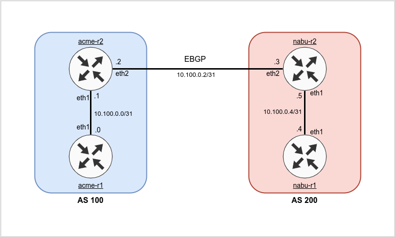

# Intro 
A simple, lightweight Network Configuration Builder & Deployer that showcases concepts related to generation of network configuration, deployment of it, pre-verification and post-verifications of deployment. Utilizing Github Actions for deployment. 

## Features
 - Scaling/Handling of multiple vendors, templates & "snippets"
 - Different methods of resource allocation for devices 
 - CI/CD in relation to config generation 
 - Schema based verification of inventory 
 - CI/CD based tests for verifying configuration
 - Pre-Deployment tests utilizing batfish for verifiying... 
 - Complete version history of: Templates & Configurations
 - Support for CLI & OpenConfig

Having a working SoT should always be priority #1. Trying to automate/generate configs for the network without this can quickly become messy. 
The idea is that you generate full configurations, and push either full configurations (replace) to devices or see (extnesions) push the difference in configs. 
With this approach, you don't need to take any backups of device configurations, as your SoT for configs is kept fully within this repository. 
Note: For lab purposes, variables have not been abstracted and are rather explicit in what they mean.
Normally it would be preferred to abstract variables and jinja2 templates

## Ansible vs Python
Generates configurations for 1000 devices in less than 2 minutes on a public github.
Finds necessary configuration files that have been updated (and are ready to be pushed) in less than 1 minute for 1000 devices.

Easy to extend functionality which is likely needed for 
Even with ansible, code will be required for certain extensions/issues. 
Speed 
Therefore, as with the concept of usin... 
Verify fast, can generate configurations for 1000 devices within a minute on github

Naturally integrates into Django/Flask
## Demo Topology 
Directions for setting up topology locally can be found here: https://github.com/a-tofft/network-labs/tree/main/network-builder



**Topology Table:**

| Device  | MGMT0       | Loopback10      | Loopback0  | OS   |
| ------- | ----------- | --------------- | ---------- | ---- |
| acme-r1 | 172.20.20.21 | 192.168.10.0/24 | 10.10.10.1 | ceos |
| acme-r2 | 172.20.20.22 | 192.168.20.0/24 | 10.10.10.2 | ceos |
| nabu-r1 | 172.20.20.23 | 192.168.30.0/24 | 10.10.10.3 | ceos |
| nabu-r2 | 172.20.20.24 | 192.168.40.0/24 | 10.10.10.4 | ceos |
|         |             |                 |            |      |

## Variables 
The less variables, the better. Rather use design decisions that naturally lead to same 
configuration on every device without requirering any more variables. For example, always use uplink on port X, always use loopback X for management etc. This reduces complexity significantly.


## Workflow 
 1. CI/CD runs 
 2. If any changes were made in below files, run:
    1. - adsd
    2. adds
    3. asd
 3. dsad

 * Branch is made and changes are done 
 * Changes are pushed to branch and tests are run 
 * If all tests are successful, the changes are pushed to the stage branch as a request
 * Changes are then accepted by a human and merged
 * Necessary configurations are pushed to devices. 

**Step 1:** - Engineer Clones Repository
```shell
git clone https://github.com/a-tofft/network-builder.git
```

**Step 2:** - Engineer Creates a new feature branch and performs changes 
```shell 
git checkout -b new_router_acme-r3
> Switched to a new branch 'new_router_acme-r3'

* Implement Changes * 

git add .
git commit -m "Added new router: acme-r3"
git push -u origin new_router_acme-r3
```

**Step 3:** - CI/CD Pipeline generates configuration & Verifies changes using Batfish
- Engineer verifies that everything looks OK 

**Step 4:** - Engineer creates a pull request to merge changes to the main branch

**Step 4:**
- After successfull Merge CI/CD Pipeline Uploads Configuration to branch 
- And then deploys them. 


# Configuration Templates & Snippets 
As the vendors in your network grow and the different device types grow, it becomes hard to maintain the templates 
for all the different devices... 


### Inventory 
Inventory is defined in inventory.yml 
See extensions for how this inventory could be based in netbox 
[Cerberus](cerberus) is used for validation of inventory. 
Tests are run against inventory as part of CI/CD to validate that all tests are correcy.
inventory-schema.yml is used to define the structure of the inventory.

### Templates 
Templates are used to describe a complete device configuration. Templates are specified using yaml. See below for all sections in a template and an example. 

<details>
<summary>Example</summary>

```YAML
router_huawei_s6720:
  device_roles: 
    - core-router
  device_types:
    - huawei_s6720
  ports: 
    - huawei_vrp_intf-infra-l3-s6720.j2
  main_config:
    - huawei_vrp_mgmt-pe.j2
    - huawei_vrp_banner.j2
    - huawei_vrp_acls.j2
    - huawei_vrp_prefix-lists.j2
    - huawei_vrp_bgp-communities.j2 
    - huawei_vrp_route-policies.j2
    - huawei_vrp_ipv6.j2
```

</details>

### Snippet 
Snippets are Jinja2 files which contain small configuration snippets, that may be common for many different device templates. See below for an example. 

<details>
<summary>Example</summary>

```JINJA
ip access-list standard IPV4-MGMT-SSH
 
 remark {{ entry.comment }}
 
 permit {{ network }}
 
 
```

</details>

# Tests 
There are device in inventory that doesn't have any available templates

# Develop locally 
 - Follow below steps to setup locally
 - Use poetry 

**Export Variables:**
```
export SSH_USERNAME=admin
export SSH_PASSWORD=admin
```

# Filters 
 * The fewer variables, the better! 
 * Filters are available at ```filters.py``` and more can be added as needed. Avoid using variables such as "mask/network/hsrp_ip" etc and instead specify prefix and use various filters to convert variable to correct format. 
 * Examples:
```
neighbor {{ intf.addr|prefix_to_ip }}
ip address {{ management.prefix_v4|prefix_to_ip }} {{ management.prefix_v4|prefix_to_netmask }}
```

# Extensions
Configuration provisioning/management can be done in many different ways and often depends 
on your organization, your requirements and what your current setup looks like. 
The /extensions directory contains example code of how the config management can be extended 
in certain ways. 


#### Integrate Resource Management 
extensions/resource-service.py
extensions/resource-template.j2
{{ name|get_resource_loopback_ipv4 }}
{{ name|get_resource_loopback_ipv4 }}
{{ name|get_resource_loopback_ipv4 }}
Showcases some examples of how resources such as VLANs, IP addresses etc can be fetched by contacting an external resource management system 
directly, rather than having the resources already delegated to the device in question.

#### External Inventory 
extensions/netbox-inventory.py
Showcases an example of how inventory.yml could be replaced with a dynamic inventory, in this example it fetches data from Netbox, transforms it into variables
and then runs as normally. 

#### CI/CD that pushes configuration on changes 
extensions/push-config.py
extensions/push-config-ci.yml
Showcases a CI/CD workflow that could be used in conjunction with config generation. This workflow will be run everytime there are changes in configs/ directory. 
It will then utilize nornir and napalm to detect the difference in configs and try and push this difference to each device in question. 

#### Validate Configurations with Batfish / netq
extensions/validate-config.py
extensions/validate-config-ci.yml
Showcases a CI/CD workflow that could be used to validate rendered configurations to make sure any changes....


#### Netconf Configuration Generation 
extensions/netconf/ 
Showcases examples of how a mix of devices, some using CLI and some using Netconf can be used 


'''
1. Load templates 
2. Load common vars 
3. Load inventory 
4. Go through inventory - Utilizing Threading 
    Generate templates and if they don't exist - Create them 
    If they exist, only overwrite existing file if there is a change (load it)
    
# Other Things:
Have Tests for each function 
Use toml for config file 
Run github action when a change is made to certain files 
Use python decorators for logging as well as debugging. 
j2lint - Lint the jinj2 config 

# Tests 
- Can inventory be read correctly?
- Has same interface been assigned multiple times? 
- Duplicate snippets 
- Duplicate templates 
- Duplicate inventories
- Validate OpenConfig yang files: https://github.com/mbj4668/pyang
- Test all filters 
- Linting / Black Code format checks 
- Verify each jinja2 template individually that they are correct. Jina2 Lint?
# License 
Do what the fuck you want 
Feel free to fork/clone and make changes.

# Thoughts 
Run Tests on any commit 
CI/CD Logging? 
Draw.io picture that Displays hierarchy of templates and snippets 
and the reasoning behind it/usability 
Use definitions for everything. def blabla(template: str, vars: dict) -> str
Let CI/CD Create an issue in case of failure? 

Use some form of check to make sure that each host has 
every parameter required in the inventory.yml file. 

https://pc.nanog.org/static/published/meetings/NANOG75/1879/20190218_Garros_Managing_Network_Device_v1.pdf

https://www.reddit.com/r/networking/comments/i827qq/network_automation_is_a_fractured_mess/

CICD: https://github.com/marketplace/actions/verify-changed-files

ZTP: https://shnosh.io/jinja2-templating-freeztp/

OpenConfig:
 - https://karneliuk.com/2018/08/openconfig-part-3-advanced-openconfig-w-ansible-for-arista-eos-cisco-ios-xr-and-nokia-sr-os-route-policy-bgp-and-interfaces-again/
 - https://ultraconfig.com.au/blog/python-automation-on-cisco-routers-in-2019/
 - https://ultraconfig.com.au/blog/introduction-to-netconf-and-juniper-yang-models/
 - https://ultraconfig.com.au/blog/how-to-configure-juniper-routers-with-netconf-via-xml-rpcs/
 - https://developer.cisco.com/network-automation/
 - https://developer.cisco.com/site/ydk/
 - Good example: https://github.com/ksator/openconfig-demo-with-juniper-devices/blob/master/dc-vmx-1.oc.bgp.conf
 - https://www.reddit.com/r/networking/comments/f7fm96/openconfig_ifip_config_container/
 - https://linuxsimba.github.io/pyang-openconfig

CI/CD:
 - https://github.com/batfish/af19-demo
 - https://www.youtube.com/watch?v=ky0pWtDrBPU (3 parts)
 - https://aristanetworks.force.com/AristaCommunity/s/article/network-ci-part-3
 - https://github.com/JohnBreth/CICD
 - https://github.com/JulioPDX/ci_cd_dev
 - https://juliopdx.com/2021/10/20/building-a-network-ci/cd-pipeline-part-1/ <-- FOLLOW THIS
 - https://github.com/JulioPDX/multi-vendor-python <-- Use arista
 - https://juliopdx.com/2021/08/15/basic-network-testing-with-nornir-and-ntc-templates/
 - https://juliopdx.com/2021/08/14/automating-mpls-l3vpns-with-nornir/
 - https://nwmichl.net/2020/10/28/network-infrastructure-as-code-with-ansible-part-1/

ContainerLab:
 - https://juliopdx.com/2021/12/10/my-journey-and-experience-with-containerlab/

Arista NetConf:
 - https://github.com/arista-netdevops-community/arista_eos_automation_with_ncclient
