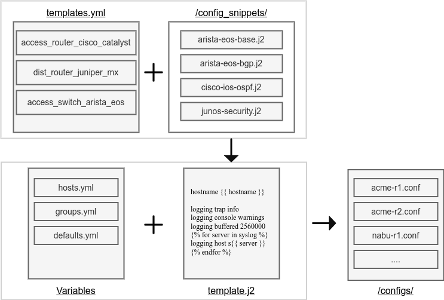

# Overview 
A simple, lightweight Network Configuration Builder & Deployer that showcases concepts related to generation of network configuration, deployment of it, pre-verification and post-verifications of deployment. Utilizing Github Actions with a local runner for deployment.

- Utilizes Nornir for Inventory and Task management, can be setup to connect to netbox or other external CMDB for inventory.
- Support for multiple vendors & reusable templates & "snippets".
- Uses Batfish for pre-deployment sanity checks.
- Utilizes Napalm for deployment & pre-deployment change verifications.

## Ansible vs Python
Python with Nornir rather than Ansible was chosen as it is very easy to extend functionality as it most likely needed with a lot of network automation scenarios & it naturally integrates into Flask/Django frameworks if needed. \
Nornir also executes tasks in parallel and can generate & deploy configurations very fast.

## Demo Topology 


**Topology Table:**

| Device  | MGMT0       | Loopback10      | Loopback0  | OS   |
| ------- | ----------- | --------------- | ---------- | ---- |
| acme-r1 | 172.20.20.21 | 192.168.10.0/24 | 10.10.10.1 | ceos |
| acme-r2 | 172.20.20.22 | 192.168.20.0/24 | 10.10.10.2 | ceos |
| nabu-r1 | 172.20.20.23 | 192.168.30.0/24 | 10.10.10.3 | ceos |
| nabu-r2 | 172.20.20.24 | 192.168.40.0/24 | 10.10.10.4 | ceos |
|         |             |                 |            |      |

## Workflow 
Example workflow of how changes to network are deployed.

**Step 1** - Admin Clones Repository
```shell
git clone https://github.com/a-tofft/network-builder.git
```

**Step 2** - Admin Creates a new feature branch and performs changes 
```shell 
git checkout -b acme-r1_new_loopback
> Switched to a new branch 'acme-r1_new_loopback'

* Implement Changes * 

git add .
git commit -m "New loopback on acme-r1"
git push
```

**Step 3** - CI/CD Pipeline verifies code/functions and generates configuration & Verifies changes using Batfish
- Napalm displays eventual changes that would be implemented
- Admin verifies that everything looks OK 

**Step 4** - Admin creates a pull request to merge changes to the main branch

**Step 4**
- After successful merge, CI/CD pipeline uploads configuration to branch and deploys it. 


# Templates, Snippets & Variables
See below for relationship between Templates/Snippets/Variables. Useful as the vendors & different device-types/roles grow and it becomes hard to maintain templates. 



## Inventory/Variables
Inventory is defined in hosts.yml, groups.yml & defaults.yml as per Nornir standard & can be extended to fetch from a custom CMDB or netbox for example. 

## Templates 
Templates are used to describe a complete device configuration. Templates are specified using yaml. See below for an example.

<details>
<summary>Example</summary>

```YAML
- template_name: arista_ceos
  device_roles:
    - access-router
  device_types:
    - ceos
  config:
    - arista-ceos-base.j2
    - arista-ceos-banner.j2
    - arista-ceos-dns.j2
    - arista-ceos-logging.j2
    - arista-ceos-mgmt.j2
    - arista-ceos-ntp.j2
    - arista-ceos-routing.j2
    - arista-ceos-ospf.j2
    - arista-ceos-bgp.j2
    - arista-ceos-intfs.j2
    - arista-ceos-security.j2
```

</details>

## Snippets 
Snippets are Jinja2 files which contain small configuration snippets, that may be common for one or more templates. See below for an example.

<details>
<summary>Example</summary>

```JINJA
ip access-list standard IPV4-MGMT-SSH
 
 remark {{ entry.comment }}
 
 permit {{ network }}
 
 
```

</details>

## Filters
The less variables, the better. Some built-in jinja2 filters can be found in `filters.py` to easily transform variables from a Prefix to a Netmask etc. \
For demo purposes, the hosts.yml variables have not been abstracted and are rather explicitly defined. \
Normally it would be preferred to have implicit variables via design decisions, such as always using port X for uplink or loopback X for management, which reduces complexity significantly.

# Develop locally 

## Fork Repository
 - Add secrets "SSH_USERNAME" & "SSH_PASSWORD"
 - Create token for github runner

## Install & Launch a local Github Runner 
- https://docs.github.com/en/actions/hosting-your-own-runners/about-self-hosted-runners

## Download & Setup Lab Topology
-  https://github.com/a-tofft/network-labs/tree/main/network-builder


## Export Variables

```
export SSH_USERNAME=admin
export SSH_PASSWORD=admin
```

## Download & Setup Batfish Docker 
 - https://github.com/batfish/batfish

## Run 
 - **Generate Configs:** `./network_builder.py --build_config`
 - **Deploy Configs:** `./network_builder.py --deploy`